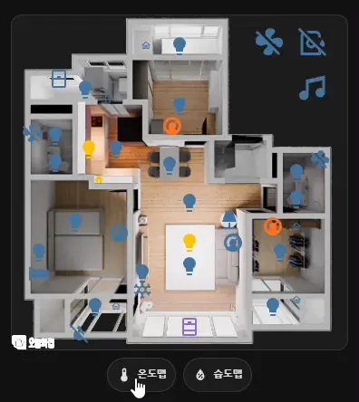
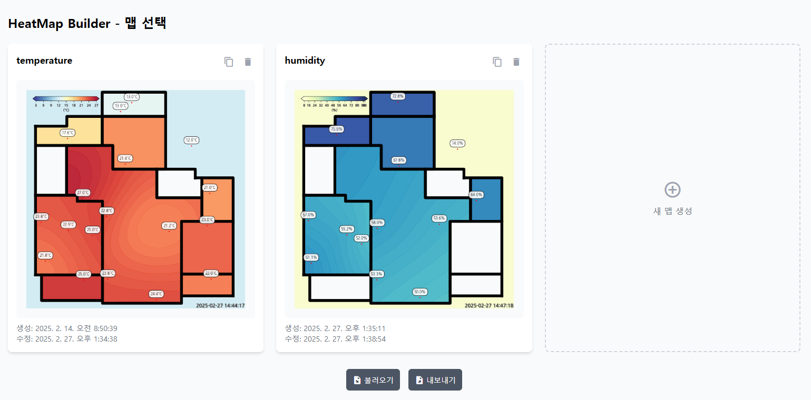
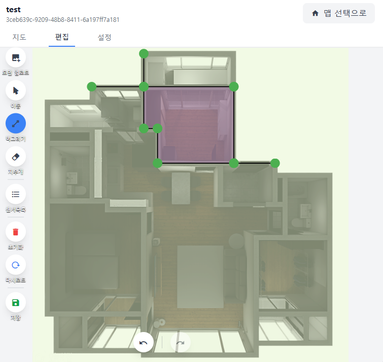
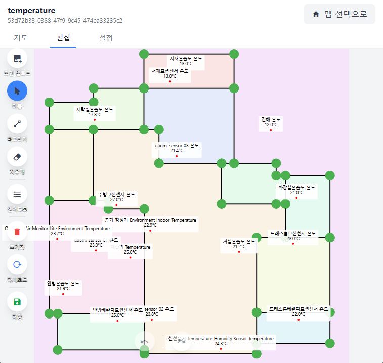
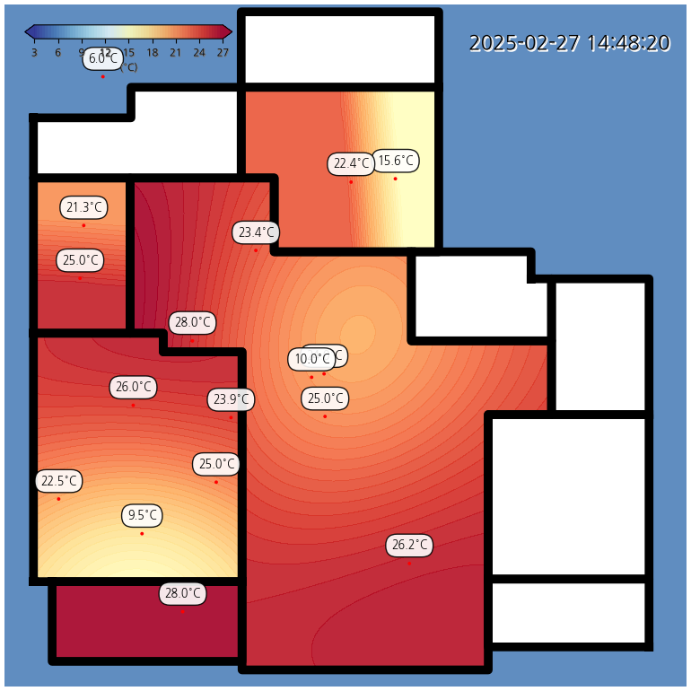
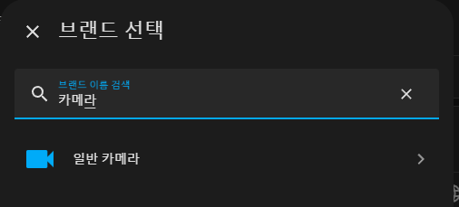
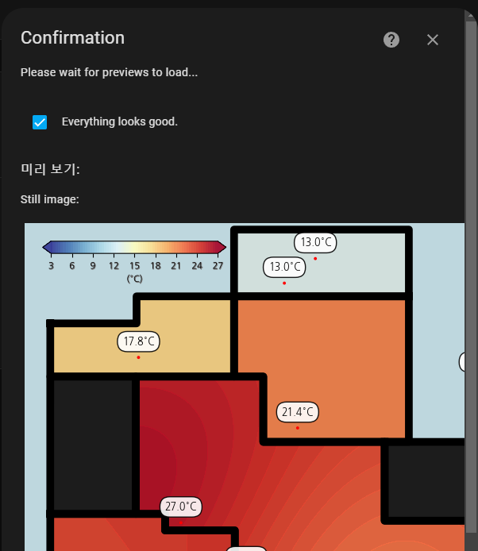

# HeatMapBuilder




## 소개
HeatMapBuilder는 Home Assistant 애드온으로 센서 데이터를 기반으로 히트맵을 생성하는 도구입니다.

## 지원하는 아키텍쳐
- amd64 이외 아키텍쳐는 테스트되지 않았습니다. 라즈베리파이(armv7)에서는 설치가 안되는것같아서 지원목록에서 제외했습니다.

## 설치 방법
1. Home Assistant의 'Supervisor' 메뉴에서 'Add-on Store'로 이동합니다.
2. 우측 상단의 메뉴에서 'Repositories'를 선택하고 다음 URL을 추가합니다:
   ```
   https://github.com/wooooooooooook/HAaddons
   ```
3. 저장소가 추가되면 add-on 목록에서 'HeatMapBuilder'를 찾아 설치합니다.
4. 설치 후 애드온을 시작하고 'OPEN WEB UI'를 클릭하여 웹 인터페이스에 접속합니다.

## 사용 방법
1. 웹 인터페이스에 접속합니다.
2. 새 맵을 생성합니다.
3. 편집 탭으로 이동하여 평면도를 업로드 하고(선택) 벽을 그립니다.

4. 센서목록을 토글하여 추적할 센서를 체크합니다.
5. 센서의 위치를 드래그하여 이동시킵니다.

6. 저장 버튼을 눌러 맵을 저장합니다.
7. 설정탭으로 이동하여 설정을 완료합니다.

## 생성된 히트맵 이미지

- 생성된 히트맵 이미지는 homeassistant/www/HeatMapBuilder/{map_id}/thermalmap.png에 저장됩니다.
- 이미지주소는 /local/HeatMapBuilder/{map_id}/thermalmap.png
- 확장자는 설정에 따라 다를 수 있습니다.
- 이미지 url은 맵 화면에서 확인할 수 있습니다.

## HA general camera integration 활용하기
- 획득한 이미지 url을 picture-elements에 넣으면 히트맵을 화면에 표시할 수 있습니다.
- 그러나 캐시때문에 이미지가 업데이트 되어도 실시간으로 반영되지 않을 수 있습니다.
- 그럴때는 HA의 카메라통합구성요소를 사용하면 좋습니다.
- HA설정 - 기기 및 서비스 - 통합구성요소 추가하기 - 일반카메라(또는 general camera) 추가



- Still image url에 히트맵 이미지 url을 입력합니다.
- 나머지설정은 취향껏 하셔도 됩니다.



- 설정후 아래에 이미지가 정상적으로 표시된다면 `Everything looks good`을 체크한뒤 확인하면 카메라 구성요소가 생성됩니다.
- picture-elements에 아래 예시와 같이 카메라 구성요소를 추가하면 히트맵을 화면에 표시할 수 있습니다.

예시: `input_boolean.show_heat_map`을 생성하여 on off 상태에 따라 카메라구성요소를 화면에 오버레이시킴
```
  - type: image
    camera_image: camera.[추가된 카메라 구성요소]
    style:
      left: 50%
      top: 50%
      width: 100%
      opacity: 0.99
    title: thermo
    entity: input_boolean.show_heat_map
    state_filter:
      "on": opacity(1)
      "off": opacity(0)
    tap_action:
      action: none
    hold_action:
      action: none
```

## 설정
- 가능한 도움말 툴팁으로 설명을 적어두었습니다.
- 보간설정의 경우 기본값으로 사용하시는걸 추천드리고, 관련 지식이 있다면 수정해서 쓰셔도 됩니다. (파라미터의 설명은 생성AI로 작성하여 정확하지 않을 수 있습니다.)

## 주의 사항
- 초기버전으로 버그가 있을 수 있습니다.
- 설치가 생각보다 오래걸릴 수 있습니다.
- 모바일에서도 사용가능하지만 화면이 작아서 사용하기 불편할 수 있습니다. PC에서 작업을 추천드립니다.
